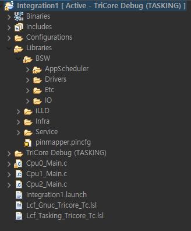

# Module-integration

<hr>

### 1. Directory Structure



### 2. Libraries

#### AppScheduler

- Driver_Stm

    - App_Stm structure
      - **stmsSfr** : STM 레지스터 베이스를 가리키는 포인터
      - **stmConfig** : STM 구성을 위한 구조체
      - **counter** : 인터럽트 카운터

    - 전역 변수
      - **g_Stm**: App_Stm 구조체의 인스턴스
      - **u32nuCounter1ms**: 1밀리초마다 증가하는 카운터
      - **stSchedulingInfo**: 다양한 타이밍에서 태스크 스케줄링을 위한 플래그

    - 함수
      - **Driver_Stm_Init()**: STM을 초기화하는 함수. 인터럽트를 일시적으로 비활성화한 후, STM 설정을 구성하고 다시 인터럽트를 활성화.
      - **STM_Int0Handler()**: STM 인터럽트 핸들러. STM 인터럽트 발생할 때 호출. 인터럽트 카운터를 증가시키고, 다양한 시간 간격(100ms, 500ms 등)에 따라 관련 플래그를 설정.   

- AppScheduling
  - 주요 변수
    - **TestCnt 구조체**: 다양한 타이밍 카운터를 위한 uint32_t 타입의 변수들을 포함 (예: u32nuCnt1ms, u32nuCnt10ms 등).
    - **static function prototype** :  AppTask100ms() 및 AppTask500ms() 함수의 프로토타입을 정의.
    - **TestCnt 변수**: stTestCnt라는 TestCnt 구조체의 인스턴스를 선언.

  - 주요 함수
    - **AppScheduling()**: 100ms와 500ms 간격으로 실행되는 태스크를 스케줄링. 특정 플래그(u8nuScheduling100msFlag)가 설정되면 해당 태스크를 실행하고 플래그를 재설정.
    - **AppTask100ms() 및 AppTask500ms()**: LED1과 LED2의 상태를 제어. 

- ERUInterrupt
  - 전역 변수 
    - **g_ERUconfig**: ERU 설정을 저장하는 구조체.
    - **INTERRUT_VAL**: 외부에서 사용될 수 있는 인터럽트 관련 변수.
  - 인터럽트 서비스 루틴(ISR)
    - **SCUERU_Int0_Handler**: 이 함수는 ERU 인터럽트가 발생할 때 실행.
  - 초기화 함수
    - **initPeripheralsAndERU()**: ERU 및 관련 주변 장치를 초기화하는 함수. 이 함수는 트리거 핀과 LED 핀의 모드, ERU의 입력 채널, 출력 채널, 트리거 조건을 설정.
  - 작동 방식
    - **ERU 초기화**: initPeripheralsAndERU 함수는 ERU 모듈을 초기화하고, 특정 핀(예: 버튼)에 대한 입력을 설정하여 인터럽트를 발생시키는 조건을 구성.
    - **인터럽트 핸들링**: SCUERU_Int0_Handler 함수는 ERU 인터럽트가 발생할 때 호출되어 INTERRUT_VAL 변수의 값을 변경. 이는 외부 버튼 입력 등에 반응하여 특정 작업을 수행.

#### Drivers

#### Etc

#### IO


### 1. Main Code

- Pseudo Code

```
Program Start

    Enable Interrupt
    Disable CPU & safety watchdogs (re-enable & service periodically if needed)

    Wait for CPU synchronization event

    Initialize peripherals & ERU
    Initialize Mystdio, GPIO, Buzzer, ToF, DC Motors

    Turn off LED1 & LED2 & Buzzer

    Begin Main Loop

        Set mode(use Interrupt value)

        Measure distance using Tof module
        Adjust speed deceleration & beep cycle based on distance

            if distance >= 100 and distance <= 200:
                speed /= 2
                beep every 0.5 seconds

            if distance <= 100:
                stop movement
                beep every 0.5 seconds

        Toggle PID control On/Off based on mode
            if mode is OFF:
                Move motor at PWM speed, log current speed
            if mode is ON:
                Control motor speed using PID, log current speed

    - (When adding periodic functionalities, AppScheduling can be incorporated for their implementation.)

    End Main Loop
Program End
```

```
프로그램 시작

    인터럽트 활성화
    CPU 및 안전 워치독 비활성화 (필요시 다시 활성화 및 주기적으로 서비스)

    CPU 동기화 이벤트 대기

    주변 장치 및 ERU 초기화
    Mystdio, GPIO, 부저, ToF, DC 모터 초기화

    LED1 및 LED2, 부저 끄기

    메인 루프 시작

        모드 설정 (인터럽트 값을 사용)

        ToF 모듈을 사용하여 거리 측정
        거리에 따라 속도 감소 및 부저 주기 조절
        
            거리가 100 이상이고 200 이하일 경우:
                속도 /= 2
                0.5초마다 부저

            거리가 100 이하일 경우:
                움직임 정지
                0.5초마다 부저

        모드에 따라 PID 제어 On/Off 토글
            모드가 꺼져 있을 경우:
                PWM 속도로 모터 움직임, 현재 속도 로그 출력
            모드가 켜져 있을 경우:
                PID를 사용하여 모터 속도 제어, 현재 속도 로그 출력

    - (주기적 기능을 추가할 때, AppScheduling을 사용하여 구현 가능.)

    메인 루프 종료
프로그램 종료
```